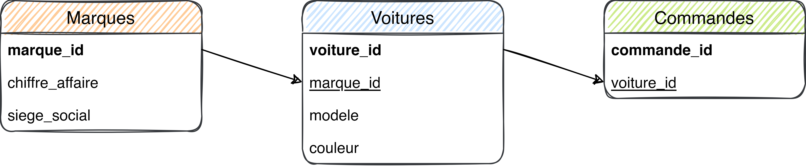
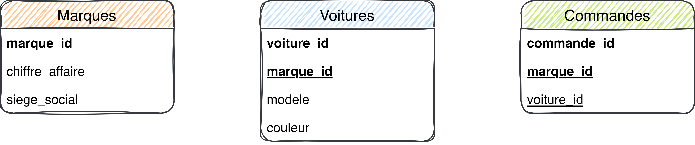
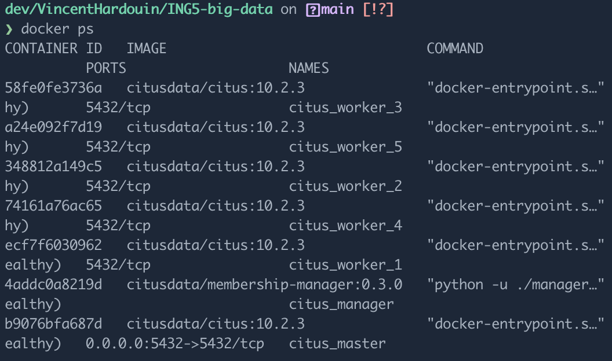

# Comment distribuer une base de données Postgres en utilisant CitusData

*Citus transforme Postgres en une base de données distribuée, pour offrir à votre application des performances élevées, quelle que soit l'échelle.*

# Auteurs ✍

Olivier GOMES

Vincent HARDOUIN

Hugo PAUTHIER

# Introduction 👋

Vous utilisez Postgres et vous chercher un moyen de scale votre base de données ? CitusData peut être la solution. Cet outil est construit comme une extension c’est à dire sur la base du projet Postgres. Cela permet ainsi de garder la quasi totalité de fonctionnalités de Postgres tout en garantissant le maximum de compatibilité.

Les avantages de Citus sont mutliples :

- Scaling horizontal
- Open Source
- Meilleure performance des requêtes

CitusData sera favorisé dans différents cas :

- Besoin de performances : Votre Postgres ne possède qu’un seul nœud et n'est donc pas assez performant et ne peut pas suivre les pics de votre charge de travail.
- Besoin d’évolution : Votre application se développe rapidement et vous voulez préparer votre déploiement Postgres avant de rencontrer des problèmes de performances.

En revanche, si Citus étend Postgres avec des fonctionnalités distribuées, il ne va pas pour autant être un remplacement immédiat permettant de scale toutes les charges de travail. Un cluster Citus performant implique une réflexion sur le modèle de données, l'outillage et/ou le choix des fonctionnalités SQL utilisées. Il faut considérer aussi que certaines charges de travail n'ont pas besoin d'une puissante base de données distribuée, bien que d'autres exigent des flux importants d'informations entre les différentes nœuds. Dans ces deux cas, Citus ne sera pas le plus optimisé et n’est donc pas recommandé.

A la suite de cette introduction nous expliquerons comment opérer une migration d’un Postgres monolithique vers un Postgres ditribué.

# Méthodologie 📑

Nous utiliserons le schéma suivant :

```sql
marques (#marque_id, nom, chiffre_affaire, siege_social) 
voitures (#voiture_id, modele, couleur, marque_id) 
commandes (#commande_id, voiture_id)
```



## Choix la colonne de distribution 🧩

Tout d’abord, pour répartir de manière optimale les données sur les différents *nodes*, l’étape primordiale est de trouver pour chaque table, la colonne à utiliser pour la distribution. Toutes les données relatives à cette colonne seront alors regroupées sur un même *node.*

## Dénormalisation des tables 🏓

Afin de pouvoir distribuer les données, il est nécessaire que la colonne de distribution soit présente dans chaque table. Ainsi, si votre base de données est normalisée, il convient de la dénormaliser. Cette étape consiste à rapatrier dans la table de base les colonnes qui étaient trouvable par double jointure. Autrement dit à ajouter la colonne de distribution dans les tables où elle n’y est pas. 

Actuellement pour retrouver le modèle de la marque de la voiture depuis la commande n**°**1, nous pouvions faire une jointure comme ceci :

```sql
SELECT M.nom FROM commandes C
INNER JOIN voitures V ON C.voiture_id = V.voiture_id 
INNER JOIN marques M ON V.marque_id = M.marque_id
WHERE C.commande_id = 1;
```

`marque_id` peut être une colonne de distribution, car nous en avons besoin tout le temps. 

Alors nous devons l’ajouter dans la table `commandes`. Il faut également ajouter la clé étrangère `marque_id` dans la table commandes. 

```sql
BEGIN;

-- Ajoute la colonne manquante dans la table commande 
ALTER TABLE commandes ADD COLUMN marque_id uuid;

-- Remplissage de la nouvelle colonne 

UPDATE commandes 
SET marque_id = voitures.marque_id
FROM commandes 
INNER JOIN voitures 
WHERE commandes.voiture_id = voitures.voiture_id;

-- Supprime toutes les clés primaire

ALTER TABLE voitures  DROP CONSTRAINT voitures_pkey CASCADE;
ALTER TABLE commandes DROP CONSTRAINT commandes_pkey CASCADE;

-- Nous recréons les clés primaire pour inclure la clé étrangère : marque_id

ALTER TABLE voitures  ADD PRIMARY KEY (voiture_id, marque_id);
ALTER TABLE commandes ADD PRIMARY KEY (commande_id, marque_id);

-- Nous récréons les clés étrangères en incluant la nouvelle colonne.

ALTER TABLE commandes ADD CONSTRAINT commandes_marques_fkey
FOREIGN KEY (marque_id) REFERENCES marques (marque_id);

ALTER TABLE commandes ADD CONSTRAINT commandes_voitures_fkey
FOREIGN KEY (voiture_id, marque_id) REFERENCES voitures (voiture_id, marque_id);

COMMIT;
```



Ici, le remplissage de la colonne peut-être très couteux. 

Nous pourrions réfléchir à séparer l’étape de la création de la colonne et la mise en place de clé primaire. Cela nous permettrait alors d’effectuer par batch le remplissage de la nouvelle colonne : `marque_id` dans la table `commandes`. 

## Mise à jour des requêtes 🚀

Comme nous venons d’ajouter une colonne, il est important de mettre à jour le code associé. 

Pour nous simplifier la vie, nous pouvons alimenter la nouvelle colonne via des triggers sur la mise à jour et l’insertion de la table en attendant la modification des requêtes dans le code.

Il reste cependant compliqué de mettre à jour toutes les requêtes afin d’utiliser la nouvelle colonne distribuée. Dans notre cas, nous avons qu’une seule table, mais dans le cas d’une vraie application cela peut devenir complexe. 

## Copie des données dans le cluster 🎭

CitusData, bien que cela soit une extension, nécessite d’être initialisé dans un premier temps sans les données. Les données doivent alors être insérées via un `pg_restore`, car tous les nodes ne contiennent pas les mêmes données.  

Nous allons alors dumper les données : 

```bash
pg_dump -h  [host] -U [user] [database_name] > [backup_name]
```

```bash
pg_restore -U [user] [db_name] [db_backup]
```

Nous pouvions aussi le faire via le Write-Ahead Logging (WAL) comme l’explique PostgreSQL dans [sa documentation](https://www.postgresql.org/docs/9.1/continuous-archiving.html).

## Utiliser la base de donnée Citus 🍋

Lorsqu’on souhaite effectuer la migration vers Citus, il faut alors réduire le traffic sur l’ancienne base de données. Pour cela, nous pouvons passer nos applications en maintenance. Puis il suffit alors de changer l’url de connexion à la base de données vers celle de Citus. 

Nous pouvons ensuite enlever le mode maintenance et vérifier le bon fonctionnement.



# Conclusion 🎇

Finalement, grâce à cette migration nous bénéficions du scaling proposé par Citus.   

Malgré que ce soit une extension de PostgreSQL, nous avons pu voir néanmoins la complexité de la mise en place de celui-ci. 

Comme nous avons pu le voir, nous avons été obligé de migrer les données vers une instance de PostgreSQL utilisant Citus. La migration sans downtime est difficile à effectuer.  

De plus comme indiqué dans la documentation, Citus est utile dans dans peu de cas d’usage, nous pouvons alors nous questionner sur la pertinence de ce dernier du fait de la complexité à migrer vers celui-ci. Nous pensons qu’il y a surement des solutions plus adaptées : étant capable de faire plus de choses, ayant une plus grosse communauté et une documentation plus fournie.